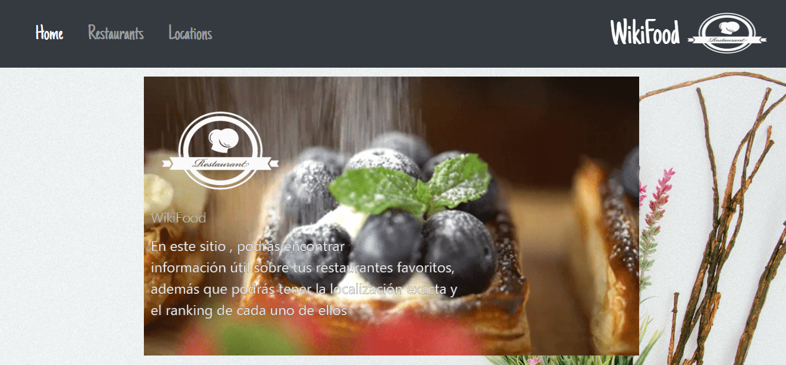
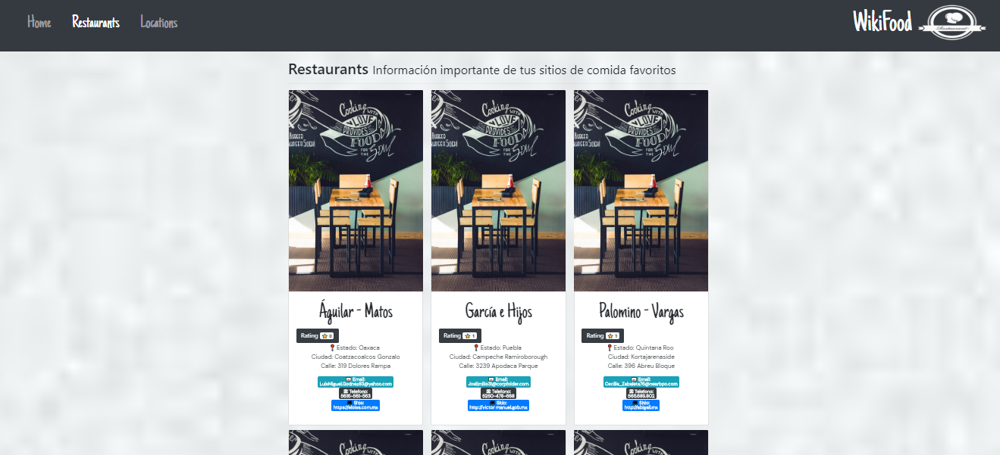
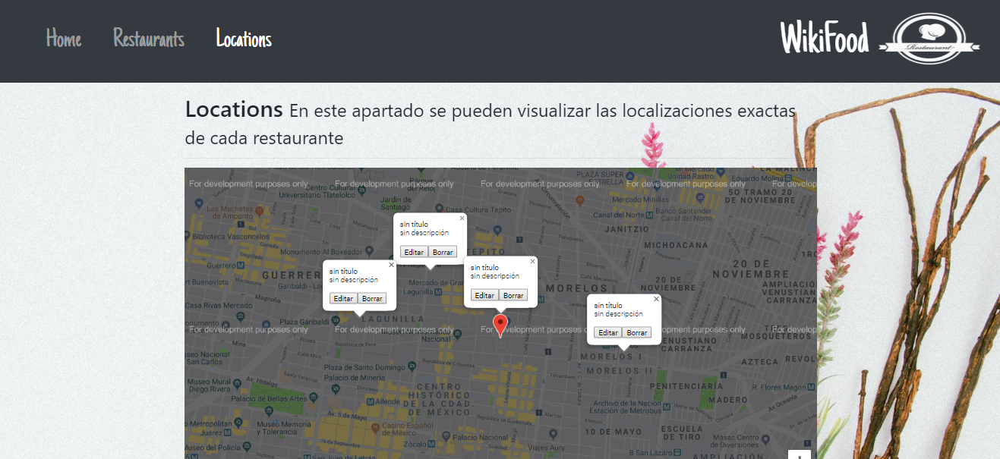

# WikiFood 2019
## Índice del proyecto de pagina

- [Descripción](#Descripción-del-proyecto)
- [Comenzando](#Comenzando)
- [Pre-requisitos](#Pre-requisitos)
- [Instalación](#Instalación)
- [Construido con](#Construido-con)
- [Contribuyendo](#Contribuyendo)
- [Versionando](#Versionando)
- [Development server](#Develpment-server)
- [Agradecimientos](#Agradecimientos)
- [Code scaffolding](#Code-scaffolding)

## Descripción

# WikiFood 

 
 - 

Es una aplicacion pensada para los amantes de la comida , se trata de un pequeño catalogo donde podras encontrar una gran variedad de restaurantes , dentro de la aplicacion existe un apartado donde se muestran los datos mas importantes de cada sitio de comida ,como por ejemplo (nombre , ciudad, direccion , telefono, sitio web, ranking )

 - 

Tambien contamos con otra seccion donde a traves de google maps se puede observar la localizacion de cada restaurant .

 - 

## Comenzando

Este proyecto toma los datos de base de datos API se utilizo el editor de texto de Visual Studio Code, con en lenguaje JavaScript, sobre el marcador de texto HTML, con el lenguaje de diseño grafico CSS, usando bootstrap ; el repositorio original se creo en git hub. A continuación las especificaciones técnicas

## Pre requisitos

Para poder descargar y usar este repositorio se necesita tener:

- un editor de texto.
- una shell para interpretar líneas de comando 
- git

## Instalación 📦 

Para poder usar el repositorio necesitas forquearlo (dando click donde dice fork) y despues clonarlo en la consola con :git clone + el url del repo.

## Construido con 
- Angular
- GoogleMaps 
- Firebase
- TypeScript
- Javascript
- Bootstrap
- HTML
- CSS

## Contribuyendo

Se agradecerá toda contribución y comentarios a este proyecto.
Para ello necesitas:

- Tener una cuenta en git.

- Haciendo fork en el repositorio de git, clonandolo de manera local en tu pc.

- Crear un repositorio en la cuenta del Github 

## Versionando

El sistema de control de versiones en este caso es el de git que permite descargar el repositorio y las actualizaciones a traves de el comando git pull. Se recomienda numerar el versionado por si se quiere tener mayor orden sobre lo que se hace.

## Licencia

- Codigo abierto
- Datos tomados de https://s3-us-west-2.amazonaws.com/lgoveabucket/data_melp.json w
- This project was generated with [Angular CLI](https://github.com/angular/angular-cli) version 7.3.8.

## Development server

Run `ng serve` for a dev server. Navigate to `http://localhost:4200/`. The app will automatically reload if you change any of the source files.

## Code scaffolding

Run `ng generate component component-name` to generate a new component. You can also use `ng generate directive|pipe|service|class|guard|interface|enum|module`.
